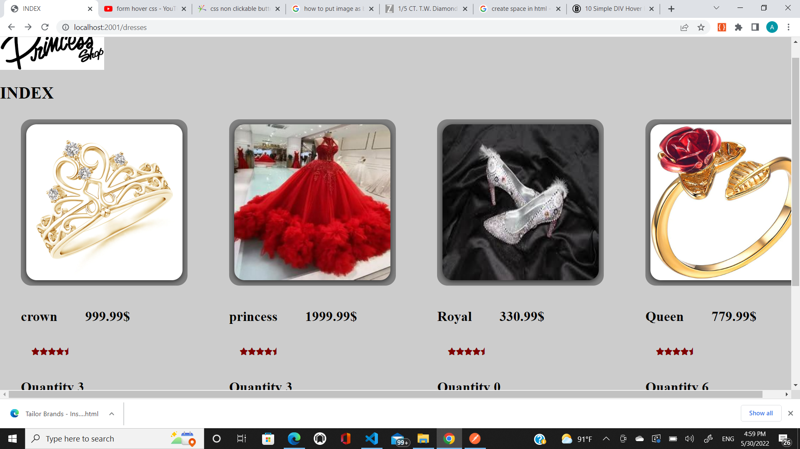
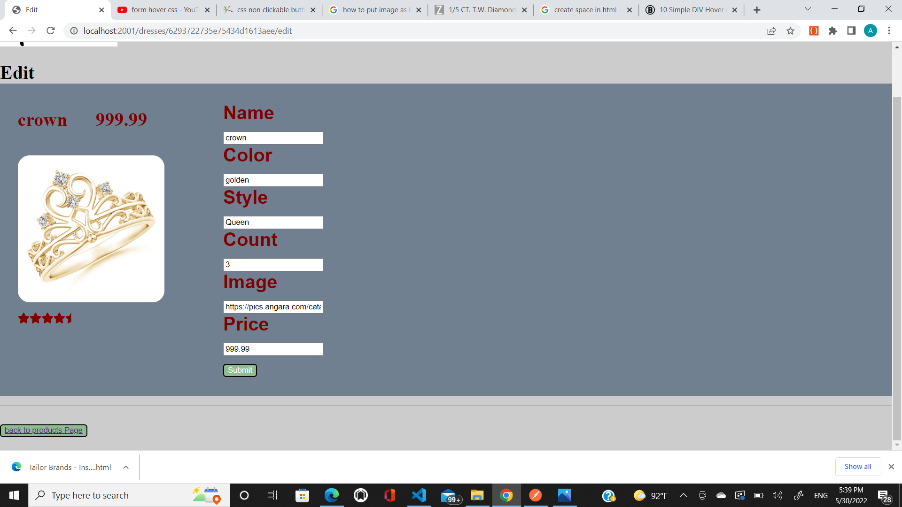
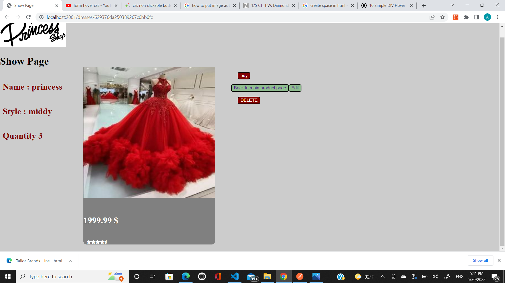
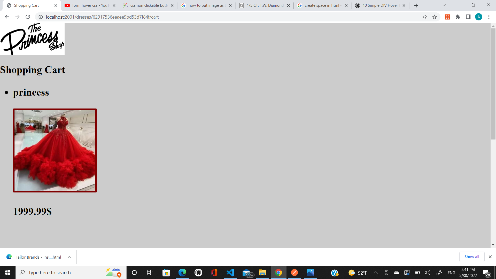

** Version 1 **
---
 Simple CRUD Shop application with 7 restfull API's routes 
---
* Get/ api/v1/ dresses/         'Index Page'
* Get/ api/v1/ dresses/:id      'Show Product's page'
* Get/ api/v1/ cart             'shopping cart'
* Get/ api/v1/dresses/new       'Create a new product'
* Delete/ api/v1/dresses/:id    'Delete product'
* put / api/v1/ dresses/:id     'update product'
* put/ api/v1/ dresses/:id/cart 'add a product to shopping cart'
  get/ api/v1/ dresses/:id/cart 'show shopping cart with order hisrtory '
* Get/api/v1/dresses/:id/edit   'edit a product'
---
---
i used React Express mongo DB to build my app 
images uploaded to github
---

Some issues need to solve
1. when i add product to my cart it does not decrease total products quantity 
2. when i add same product to the cart it should increase the quantity by 1 and with only one image for the product 
screen shots
---
index Page
---

---
Edit Page
---
---

---
show page
---

---
cart
---

